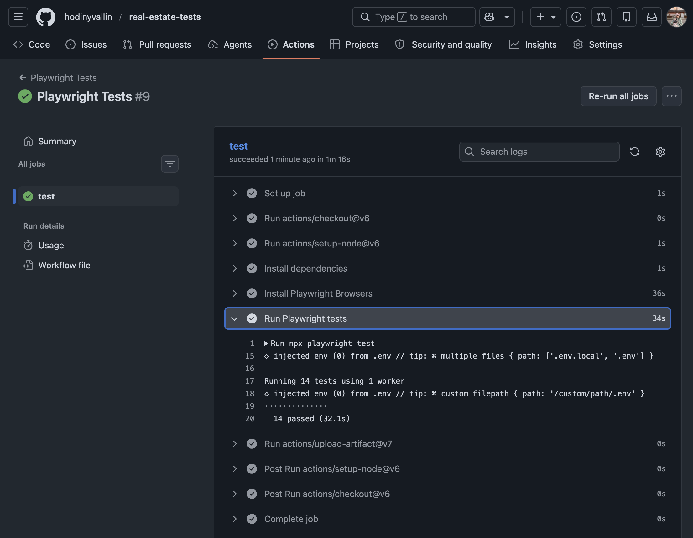

## E2E automation framework for a real estate platform 🏠

> End-to-end tests for the core functionalities of a real estate platform.
> **Stack:** Playwright, JavaScript, GitHub Actions, GitHub Secrets, Dotenv, Faker.

---

### Test Coverage

- Login
  - User can log in with valid credentials
  - User can log out
- Registration
  - User can register a new account
  - Registration fails when user registers an existing email account
  - Registration fails when user leaves required fields blank
  - Registration fails when user inputs invalid email
- Search & Filter (on Home page and Featured Listings page)
  - User can search by title
  - User can search by bedroom count
  - User can search by city
  - User can search by price

---

### Page Object Model

- UI interactions, locators, and page-state actions are encapsulated within dedicated page objects.
- Pages which share common UI elements and actions inherit from the `SearchComponent` partial.
- Backend HTTP actions are encapsulated within API objects, adapting the POM pattern to the network layer.
- Although I prefer to keep setup/teardown API actions in fixtures, I decided to follow an API POM pattern for steps such as:
  - Session token acquisition (`AuthenticationApi`)
  - Mock user account creation and deletion (`UsersApi`)
  - Mock real estate listing creation and deletion (`ListingApi`)

---

### Fixtures

- `sharedFixtures` contain common setup steps such as:
  - Page instantiation
  - Retrieving an access token
  - Authenticating the context/session
- `searchFixtures` extend the base further to contain search-related setup and teardown:
  - Instantiating, using, then deleting mock listings

---

### Mock Listing Generation

- Mock listing data (specifically unique numeric inputs: price, lot size, etc.) is generated through the `faker` library.
- The .png file is streamed into the API request through the Node.js `fs` module, so that the server receives and displays the image.

---

### Authentication Handling

- Via `AuthenticationApi`, credentials stored in secure environment variables are exchanged for an access token, keeping auth logic reusable.
- Via `authenticatedPage` fixture, the access token is injected into the browser's `localStorage` to authenticate the context, bypassing the login UI entirely.

---

### Secrets/Credential Management

- Credentials are kept secure in an untracked root `.env` file, and made accessible to tests via `dotenv`.
- The credentials are encrypted in GitHub Secrets so that remote CI runs can access them.

---

### Configuration

- Tests are configured to run with 1 worker locally and on CI.
  - 1 worker avoids resource contention from parallel runs, which causes slower load times on the Featured Listings page and a longer overall runtime.
- Tests only run in Chromium.

---

### Run in CI

To run all tests in GitHub Actions:

1. Go to the repository Actions tab.
2. Select the Playwright Tests workflow from the left panel.
3. Click on the 'Run workflow' button on the top right.

Note that:

- Tests run headlessly (invisibly) in CI.
- The `workflow_dispatch` event trigger enables us to manually run tests with a click on the 'Run workflow' button.
- All tests will run on every pull request via the same workflow.

---

### Test Report

To view a HTML report of the test run:

1. Go to the repository Actions tab.
2. Select the most recent run of the Playwright Tests workflow.
3. Go to Summary on the left panel.
4. Scroll down to Artifacts.
5. Download playwright-report.zip.
6. Open the index.html file to view the test report.

---

### Test Results

> 14 tests passed in CI

---

### Future Considerations

- Add negative validation assertions to `login.spec.js`, such as for invalid email, invalid password, and empty inputs.
- Refactor registration teardown logic into a preventative before hook to guarantee cleanup, even if unexpected runtime errors halt the tests.
- Extract identical search steps in `search.homePage.spec.js` and `search.listingsPage.spec.js` tests into a shared helper to avoid duplication.
- Extract the Listing Details assertions from 'User can search by city' into a separate test, since those assertions verify elements on the Listing Details page specifically.
- Add a `.env.example` file as a template showing which environment variables are needed (with empty values), so anyone cloning the repo knows exactly what to set up.